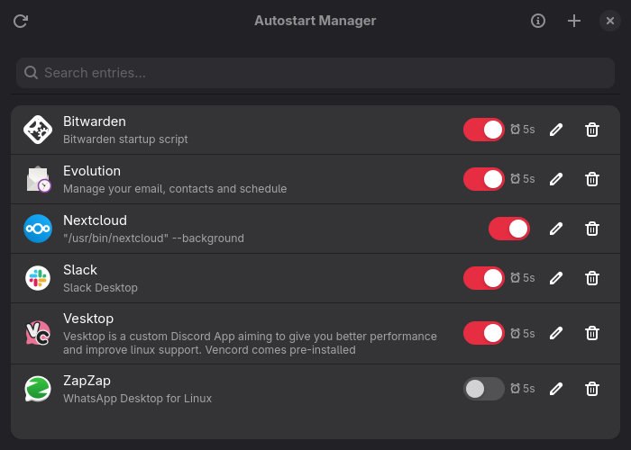

<p align="center">
  
</p>

# Onset

[](https://github.com/xPathin/onset/actions/workflows/ci.yml)
[](https://github.com/xPathin/onset/actions/workflows/release.yml)
[](https://github.com/xPathin/onset/releases/latest)
[](https://aur.archlinux.org/packages/onset)
[](https://aur.archlinux.org/packages/onset-git)
[](LICENSE)

A lightweight GTK4/libadwaita application for managing XDG autostart entries on Linux.



## Features

- **View autostart entries** from your user directory
- **Create new entries** from installed applications or custom commands
- **Edit entries** — modify name, command, comment, and startup delay
- **Enable/Disable** entries without deleting them
- **Startup delay** — optionally delay application startup
- **XDG compliant** — follows freedesktop.org specifications

## Installation

### Arch Linux (AUR)

```bash
paru -S onset          # latest release
paru -S onset-git      # latest main branch
```

### Pre-built Binaries

Download from the [latest release](https://github.com/xPathin/onset/releases/latest).

### From Source

```bash
# Dependencies (Arch)
sudo pacman -S gtk4 libadwaita rust

# Build
cargo build --release

# Install
sudo install -Dm755 target/release/onset /usr/bin/onset
sudo install -Dm644 data/com.github.xPathin.onset.desktop /usr/share/applications/com.github.xPathin.onset.desktop
sudo install -Dm644 data/icons/hicolor/scalable/apps/com.github.xPathin.onset.svg /usr/share/icons/hicolor/scalable/apps/com.github.xPathin.onset.svg
```

## Usage

Launch `onset` from your application menu or terminal.

- **Toggle switch** — Enable/disable an entry
- **Edit button** — Modify entry settings
- **Delete button** — Remove the entry
- **+ button** — Add a new autostart entry
- **Refresh button** — Reload entries from disk

## Dependencies

- GTK 4.12+
- libadwaita 1.4+

## License

[MIT](LICENSE)
